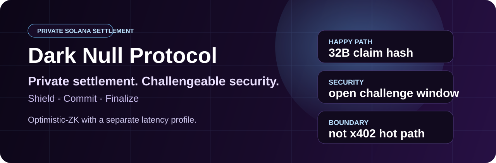

# Dark Null Protocol: Canonical Public Devnet Track




**Private settlement research on Solana, published without pretending more than the repo proves.**

Dark Null's public edge is evidence density: the root verifier, circuit artifacts, manifest, IDL, SDK, and reproducible proof tests are published together. The repo is built to make serious claims traceable to code and hashes, not launch theater.

This repo now has one canonical public root:

- one program ID: `2stas3cZYnBiWpndcTXQDGLXwfQ7kjEYYrW52DsUAcxF`
- one root manifest: [`MANIFEST.json`](./MANIFEST.json)
- one network map: [`NETWORKS.json`](./NETWORKS.json)
- one root IDL: [`idl/paradox.json`](./idl/paradox.json)
- one root circuit bundle: [`circuits/null_proof.circom`](./circuits/null_proof.circom), [`circuits/null_proof_final.zkey`](./circuits/null_proof_final.zkey), [`circuits/null_proof_js/null_proof.wasm`](./circuits/null_proof_js/null_proof.wasm), [`circuits/vk.json`](./circuits/vk.json)
- one root verifier path: [`src/lib.rs`](./src/lib.rs) + [`src/verifying_key.rs`](./src/verifying_key.rs)
- one published security model: [`SECURITY_MODEL.md`](./SECURITY_MODEL.md)

Historical branches and artifact bundles are still published, but they are no longer the main integration target.

**Search tags:** `solana`, `zk-snarks`, `zero-knowledge proofs`, `groth16`, `circom`, `bn254`, `privacy payments`, `anchor`, `snarkjs`, `solana program`

## Market Position

Dark Null is the compact, evidence-first Solana privacy settlement track:

- `256-byte` current `groth16-solana` verifier ABI
- `128-byte` compressed proof target
- canonical artifact manifest with stable hash checks
- reproducible Groth16 proof flow
- fail-closed payout path until amount, receiver token account, and mint are proven by promoted v2 artifacts
- public launch gate that blocks unsupported mainnet claims

For launch copy and positioning, read [`docs/LAUNCH_NARRATIVE.md`](./docs/LAUNCH_NARRATIVE.md). For the release gate, read [`docs/MAINNET_READINESS.md`](./docs/MAINNET_READINESS.md) and [`docs/MAINNET_RUNBOOK.md`](./docs/MAINNET_RUNBOOK.md).

## One Command Bootstrap

```bash
sh scripts/bootstrap.sh
```

That installs npm dependencies and runs the public repo checks.

If you want the extended validation path:

```bash
FULL_VALIDATION=1 sh scripts/bootstrap.sh
```

## Canonical Network Selection

```bash
npm run config:devnet
npm run config:localnet
```

For machine-readable output:

```bash
npm run config:json:devnet
```

Canonical defaults also live in [`.env.example`](./.env.example).

## npm SDK

```bash
npm install @dark-null/protocol
```

For Anchor-based integrations:

```bash
npm install @dark-null/protocol @coral-xyz/anchor @solana/web3.js
```

## What Is Canonical

| Area | Root path |
|---|---|
| Program binding | [`MANIFEST.json`](./MANIFEST.json), [`Anchor.toml`](./Anchor.toml), [`src/lib.rs`](./src/lib.rs) |
| Network config | [`NETWORKS.json`](./NETWORKS.json), [`.env.example`](./.env.example), [`scripts/network-config.mjs`](./scripts/network-config.mjs) |
| Verifier | [`src/verifying_key.rs`](./src/verifying_key.rs), [`circuits/vk.json`](./circuits/vk.json) |
| Circuit artifacts | [`circuits/null_proof.circom`](./circuits/null_proof.circom), [`circuits/null_proof_final.zkey`](./circuits/null_proof_final.zkey), [`circuits/null_proof_js/null_proof.wasm`](./circuits/null_proof_js/null_proof.wasm) |
| Proof encoding | 256-byte current `groth16-solana` verifier ABI; 128-byte compressed proof target |
| Public IDL | [`idl/paradox.json`](./idl/paradox.json) |
| JavaScript SDK | [`sdk/index.mjs`](./sdk/index.mjs), [`sdk/index.d.ts`](./sdk/index.d.ts) |
| Python helper client | [`client/dark_client.py`](./client/dark_client.py) |
| Canonical proof-flow test | [`tests/canonical-proof-flow.test.mjs`](./tests/canonical-proof-flow.test.mjs) |

## What Is Historical

| Area | Historical path |
|---|---|
| Promoted provenance branch | [`historical/null-mint`](./historical/null-mint) |
| Archived toy public root | [`historical/root-toy-prototype`](./historical/root-toy-prototype) |
| Older full-cycle artifact bundle | [`LIVE_TEST_RESULTS.md`](./LIVE_TEST_RESULTS.md), [`full_cycle_results.json`](./full_cycle_results.json) |

## What This Repo Does Prove

- a real Groth16 verifier path is published in the root
- the root circuit, zkey, wasm, and vk are internally consistent
- the full local validation lane is reproducible with `npm run test:all`
- the root devnet/localnet selection now resolves through one published config surface
- root updates are no longer open to any signer in the current root source
- bounded root, leaf, and nullifier storage now fail closed instead of overwriting silently
- the public root fails closed before payout if a proof does not bind withdrawal amount and recipient semantics
- the planned `prepare_phantom_withdraw_v2` interface and SDK/client encoders bind amount, receiver token account, and mint in public inputs, while still failing closed until v2 artifacts are promoted
- the repo has one canonical public root path instead of a placeholder root plus side branch

## What This Repo Does Not Prove

- third-party audit completion
- mainnet readiness
- that every historical deployment in the repo used the current root files
- that switching `devnet` to `mainnet` is enough to ship
- append-only root derivation on-chain; the current source still trusts a privileged root updater
- a safe public withdrawal payout path from the canonical root; both withdraw paths reject payout until amount/recipient binding is promoted into the canonical circuit and manifest

## Verification Flow

1. Run `sh scripts/bootstrap.sh`.
2. Run `npm run config:devnet` or `npm run config:localnet`.
3. Read [`MANIFEST.json`](./MANIFEST.json), [`NETWORKS.json`](./NETWORKS.json), and [`docs/PROGRAM_IDS.md`](./docs/PROGRAM_IDS.md).
4. Run `npm run test:all`.
5. Run `npm run check:mainnet:evidence` and expect it to fail until `MAINNET_EVIDENCE.json` is real.
6. Run `npm run check:mainnet` and expect it to fail until the blockers in [`docs/MAINNET_READINESS.md`](./docs/MAINNET_READINESS.md) are cleared.

## For Integrators and Agent Builders

| If you need... | Use Dark Null for... |
|---|---|
| privacy-oriented settlement research | deposit flows, root updates, proof artifact verification, and source/security review |
| public code review | root Rust program, circuits, client helpers, SDK, IDL, and historical evidence |
| machine-speed per-request API payments | **not this repo** - use [`dna-x402`](https://github.com/Parad0x-Labs/dna-x402) |

## Review Status

- No third-party audit has been completed yet.
- The repo includes an internal technical review summary in [`INTERNAL_REVIEW.md`](./INTERNAL_REVIEW.md).
- The canonical root is now bound by [`MANIFEST.json`](./MANIFEST.json).
- The current source security model is documented in [`SECURITY_MODEL.md`](./SECURITY_MODEL.md).
- Historical program IDs are cataloged in [`docs/PROGRAM_IDS.md`](./docs/PROGRAM_IDS.md) instead of being implied as one release.

## License

Everything currently in this repository is released under the MIT License. See [`LICENSE`](./LICENSE).
