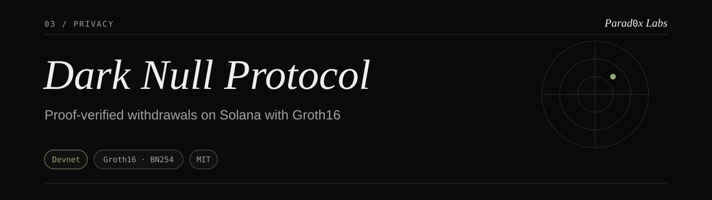
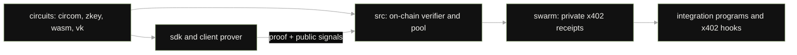

<p align="center"></p>

**Dark Null is a privacy settlement protocol for Solana, built for apps and AI agents that need payments to settle privately, with proof. It is not a mixer.**

Money on a blockchain is public by default: anyone can see who paid whom. With Dark Null, a withdrawal cannot be linked to the deposit that funded it, yet every payout is still checked on-chain by a zero-knowledge proof. Deposit amounts and depositors stay visible by design; [`SECURITY_MODEL.md`](./SECURITY_MODEL.md) draws the exact privacy boundary.

## At a glance

| Groth16 payout on devnet | Drain and replay refused | 154 tests, 10/10 proof tests |
|---|---|---|
| A real proof was verified by the on-chain BN254 verifier and the vault paid out: tx [`3wXv6wGS…`](https://explorer.solana.com/tx/3wXv6wGS5t7fu2F18ZVGPiSkbJcGA16mftZec7LDHq5wTvZBc4ezb44kuUw97BPXrwYXyoSF42MPKrbuJJM6n2nU?cluster=devnet), slot 487904628. | Against the deployed program, an over-claim is rejected with error 6013 `InsufficientCommittedDeposit` and a re-submitted spent note with 6000 `DoubleSpend`. | `npm test` runs 154 tests plus the repo checks; `npm run test:proof` passes 10/10. Both run offline. |

[](https://github.com/Parad0x-Labs/Dark-Null-Protocol/actions/workflows/ci.yml)


## How it works


```mermaid
%%{init: {'theme':'base','themeVariables':{'primaryColor':'#111111','primaryTextColor':'#f0efeb','primaryBorderColor':'#92aa7c','lineColor':'#a3a3a3','secondaryColor':'#0a0a0a','tertiaryColor':'#0a0a0a','fontFamily':'JetBrains Mono, monospace'}}}%%
flowchart LR
    A[Depositor funds the pool] --> B[Shielded pool stores a commitment]
    B --> C[Client builds a Groth16 proof locally]
    C --> D[On-chain verifier checks proof, funds and nullifier]
    D --> E[Vault pays the receiver]
```

1. A deposit goes into the shielded pool, which records a commitment carrying the funded amount.
2. To withdraw, the client builds a Groth16 proof that the withdrawal is valid, without revealing which deposit it came from.
3. The proof binds amount, receiver token account and mint (`prepare_phantom_withdraw_v2`), so a proof for someone else's destination is worthless to you.
4. The program checks the proof, refuses anything above what was deposited, records the nullifier so the note cannot be spent twice, then pays out.

## Quickstart

The SDK (package name `@dark-null/protocol`) is used from a clone of this repository; it is not published to the npm registry.

```bash
git clone https://github.com/Parad0x-Labs/Dark-Null-Protocol
cd Dark-Null-Protocol
sh scripts/bootstrap.sh     # npm install, then npm test
npm run test:proof          # Groth16 proof encoding and malformed-proof tests
```

Select the canonical network, and check the private x402 receipt path:

```bash
npm run config:devnet
npm run config:localnet
npm run check:x402
```

Entry points: [`sdk/index.mjs`](./sdk/index.mjs) and [`sdk/index.d.ts`](./sdk/index.d.ts). For Anchor-based integrations, add `@coral-xyz/anchor` and `@solana/web3.js` to your own project. A step-by-step walk-through is in [`docs/getting-started.md`](./docs/getting-started.md).

## Status

| Component | Status | Notes |
|---|---|---|
| Groth16 circuit, verifying key and client prover | **Usable today** | Circuit, zkey, wasm and vk hash-pinned in [`MANIFEST.json`](./MANIFEST.json); 256-byte `groth16-solana` verifier ABI, 128-byte compressed proof target |
| JavaScript SDK and Python helper client | **Usable today** | From a clone; not published to the npm registry |
| Private x402 receipt primitives | **Usable today** | [`swarm/x402.mjs`](./swarm/x402.mjs); wraps DNA x402 signed receipts with no raw URL or payment header stored |
| Frontier prototypes (6) | **Usable today** | Prototype code with local tests; not deployed to production. See [`docs/2030_PRIMITIVES.md`](./docs/2030_PRIMITIVES.md) |
| Shielded-pool program `35GMe13ExGB1JGp1wZGrEvHfQnENKADroDQApeziKuwV` | **Devnet** | Canonical devnet root and integration target; matches `declare_id!` in [`src/lib.rs`](./src/lib.rs); upgrade authority `4cTBfB8v…` |
| Six integration programs | **Devnet** | silent-pay `9VYPtdr…`, payment-stream `J6oHoys…`, threshold-fed `4sMywVPL…`, fiat-oracle `AJHHpWv…`, accumulator `ByFb6xc…`, inference `6h4yKZG…`; deployed from this source tree |
| On-chain receipt anchoring (`receipt_anchor`, in dna-x402) | **Built · redeploy pending** | Unavailable until the `receipt_anchor` program is redeployed under a fresh key |
| Research-stage primitives (7) and one blocked primitive | **Planned** | Design and specification only; Confidential Token-2022 linkage is blocked on Token-2022 Confidential Transfer extension audit completion and SIMD stabilization |
| Mainnet deployment | **Planned** | No Dark Null program is deployed on mainnet today; the gates are listed in [`docs/PROJECT_DETAIL.md`](./docs/PROJECT_DETAIL.md#mainnet-gates) |

Where any doc differs, [`MANIFEST.json`](./MANIFEST.json) and [`docs/PROGRAM_IDS.md`](./docs/PROGRAM_IDS.md) are authoritative. The delivered-vs-blocked claim boundary is in [`docs/CLAIMS_LEDGER.md`](./docs/CLAIMS_LEDGER.md).

## For developers

### Repo map

| Path | What lives there |
|---|---|
| [`src/`](./src) | Root Anchor program: shielded pool, Groth16 verifier, `prepare_phantom_withdraw_v2` |
| [`circuits/`](./circuits) | `null_proof.circom`, final zkey, wasm witness generator, `vk.json` |
| [`sdk/`](./sdk) | JavaScript SDK (`@dark-null/protocol`) with types |
| [`client/`](./client) | Python helper client and proof packer |
| [`swarm/`](./swarm) | Private x402 receipts, receipt DAG, batch settlement and other frontier prototypes |
| [`programs/`](./programs) | The six native integration programs deployed on devnet |
| [`integration/`](./integration) | JS helpers and x402 hooks for the integration programs |
| [`idl/`](./idl) | Public IDL (`paradox.json`) |
| [`scripts/`](./scripts) | Bootstrap, repo checks, network config, e2e and release tooling |
| [`tests/`](./tests) | Proof, artifact, config, x402 and frontier test suites |
| [`docs/`](./docs) | Specs, program IDs, claims ledger, auditor handoff, runbooks |

### Architecture


```mermaid
%%{init: {'theme':'base','themeVariables':{'primaryColor':'#111111','primaryTextColor':'#f0efeb','primaryBorderColor':'#92aa7c','lineColor':'#a3a3a3','secondaryColor':'#0a0a0a','tertiaryColor':'#0a0a0a','fontFamily':'JetBrains Mono, monospace'}}}%%
flowchart LR
    C[circuits: circom, zkey, wasm, vk] --> S[sdk and client prover]
    C --> V[src: on-chain verifier and pool]
    S -->|proof + public signals| V
    V --> X[swarm: private x402 receipts]
    X --> I[integration programs and x402 hooks]
```

### Run the tests

| Command | What it covers |
|---|---|
| `sh scripts/bootstrap.sh` | Install, then `npm test` (repo checks plus SDK, config, x402, artifact and frontier suites) |
| `npm run test:proof` | Proof encoding, malformed proofs, mainnet readiness and evidence gates |
| `npm run test:batch` | Sequential Groth16 batch settlement with real snarkjs proofs |
| `npm run check:claims` | Claim boundary scan across README, docs and SDK |
| `FULL_VALIDATION=1 sh scripts/bootstrap.sh` | Everything in `npm run test:all`, including Rust, Python and release checks |
| `npm run check:x402:devnet` | Checks the canonical devnet settlement when RPC access is available |

### Frontier primitives

Twenty primitives across four tiers; these are gated research primitives, not launch claims. Each tier, test count and devnet program is listed in [`docs/PROJECT_DETAIL.md`](./docs/PROJECT_DETAIL.md#frontier-primitives-20-total), and the full specification with activation blockers is in [`docs/2030_PRIMITIVES.md`](./docs/2030_PRIMITIVES.md).

```yaml
frontier_primitives:
  status: 6_prototype_code_6_devnet_programs_7_research_1_blocked
  base_delivered:
    - groth16_verifier_path
    - payout_bound_withdraw_v2
    - manifest_locked_artifacts
    - private_x402_receipt_primitives
  prototypes:
    - dark_null_x402_privacy_extension
    - receipt_dag_append_only
    - recursive_settlement_batches
    - zk_access_receipts
    - piano_pir_access_pattern_privacy
    - bdhke_blind_receipt_tokens
  devnet_programs:
    - silent_payment_rails: 9VYPtdr19RDBVTV1WJ1stkCisucre2Bvcpt91KyfYszR
    - fiat_settlement_oracle: AJHHpWv1eD2cq9iRM7RtUyA6C7QpYLgWKa5vUbgRWY7m
    - threshold_blind_mint_federation: 4sMywVPL5waxniQDs5pDuhc1E4uUWjqh1ob17fY82VQz
    - receipt_commitment_accumulator: ByFb6xcQTgG4fai31Zto7qpQve1eBo3cc2qrAJU5tN7k
    - oracle_attested_inference_receipt: 6h4yKZGFYHAVkctUVqD4wrXCYeostHBhG6T3FCVAqr3f
    - private_streaming_micropayments: J6oHoysM1RGs3yZPXBp9ZUgdYgGQWZf2wKisS1tJQdaQ
  research:
    - compressed_anonymity_state
    - proof_carrying_relayer_swarm
    - ephemeral_private_sessions
    - finality_aware_alpenglow_receipts
    - mpc_sealed_pricing
    - mev_aware_routes
    - x402_bazaar_private_reputation
  blocked:
    - confidential_token2022_linkage
```

### Further reading

| Topic | Doc |
|---|---|
| Devnet proof cycle, canonical paths, verification flow, mainnet gates | [`docs/PROJECT_DETAIL.md`](./docs/PROJECT_DETAIL.md) |
| Program IDs | [`docs/PROGRAM_IDS.md`](./docs/PROGRAM_IDS.md) |
| Private x402 payments and the DNA x402 receipt boundary | [`docs/PRIVATE_X402_PAYMENTS.md`](./docs/PRIVATE_X402_PAYMENTS.md), [`docs/DNA_X402_INTEGRATION.md`](./docs/DNA_X402_INTEGRATION.md) |
| External review packet | [`docs/AUDITOR_HANDOFF.md`](./docs/AUDITOR_HANDOFF.md) |
| Release gate | [`docs/MAINNET_READINESS.md`](./docs/MAINNET_READINESS.md), [`docs/MAINNET_RUNBOOK.md`](./docs/MAINNET_RUNBOOK.md) |
| Trusted setup evidence | [`CEREMONY.md`](./CEREMONY.md) |
| How it fits the Parad0x Labs stack | [`docs/PARADOX_STACK.md`](./docs/PARADOX_STACK.md) |

## Security

Report issues to `security@parad0xlabs.com`; scope and process are in [`SECURITY.md`](./SECURITY.md). The privacy boundary and threat model are in [`SECURITY_MODEL.md`](./SECURITY_MODEL.md), and the review history is in [`INTERNAL_REVIEW.md`](./INTERNAL_REVIEW.md) and [`docs/PROJECT_DETAIL.md`](./docs/PROJECT_DETAIL.md#review-status). Released under the MIT License, see [`LICENSE`](./LICENSE).

Parad0x Labs · [parad0xlabs.com](https://parad0xlabs.com)
